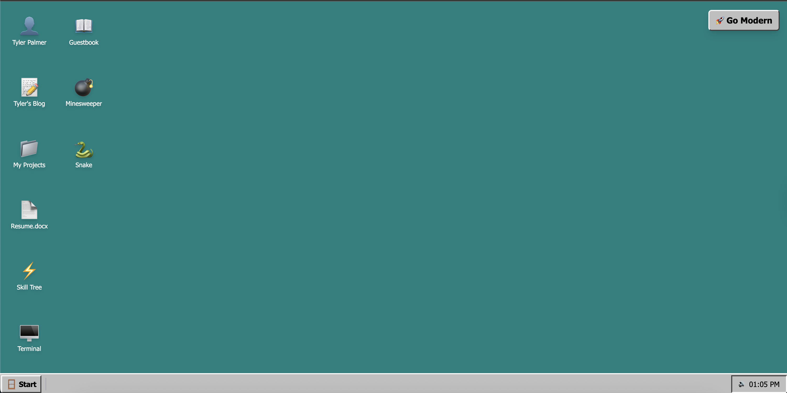
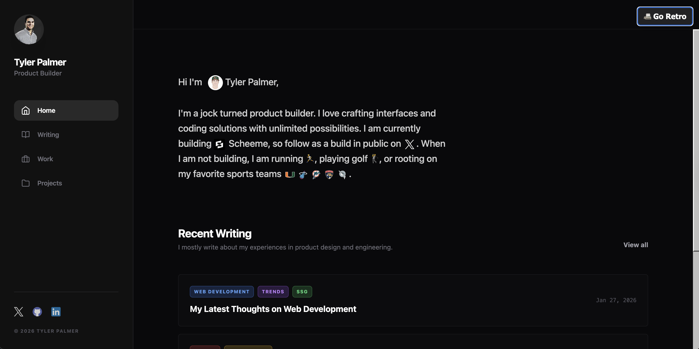

  
  

# Retro OS & Modern Blog

TP-OS is a nostalgic desktop environment built with React and Vite, featuring a retro-style interface with modern functionality. The app includes a desktop environment with icons for various applications, a taskbar, and a terminal emulator. It also features a modern blog built with React and Vite, featuring a dark theme and a responsive layout.

## Key Features

- Retro-style desktop environment with modern functionality
- Modern blog with dark theme and responsive layout
- SEO Optimized pages on build
- No server needed
- No Database needed
- Markdown supported for blog posts
- Tailwind CSS for styling
- React for frontend
- Vite for build tool
- SSG

## Run Locally

**Prerequisites:**  Node.js

1. Install dependencies:
   `npm install`
2. Run the app:
   `npm run dev`

## Build

1. Generate Blogs from Markdown:
   `npm run generate-blog`
2. Build the app:
   `npm run build`

## Deploy

1. Deploy the app to static hosting service
   a. Use files generated in `dist` directory

